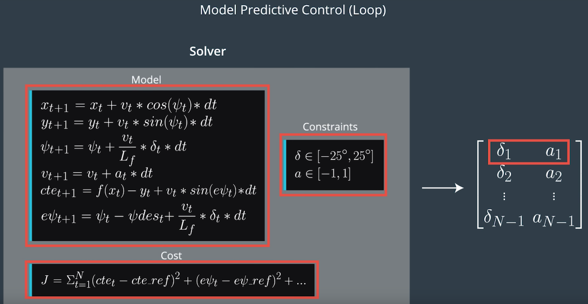
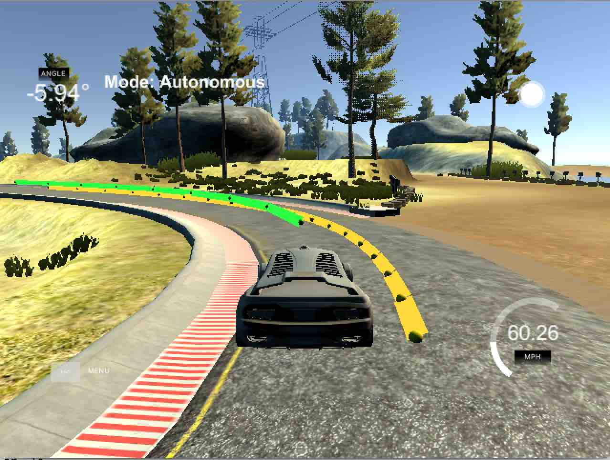

Model Predictive Control (MPC)
--
## Student describes their model in detail. This includes the state, actuators and update equations.
The model has 6 states:
```
// x coordinates
double x = state[0];
// y coordinates
double y = state[1];
// angle
double psi = state[2];
// speed
double v = state[3];
// cross track error to reference line
double cte = state[4];
// orientation error to reference line
double epsi = state[5];
```

2 actuators:
`delta` is the turning speed and `a` is the acceleration (throttle).

The update functions (according to lectures):



However, the sign of the `vt / Lf * delta * dt` term in both the `psi` and `epsi` update functions are used oppositely in the code. Not sure if it's a bug in the lectures. 

## Student discusses the reasoning behind the chosen N (timestep length) and dt (elapsed duration between timesteps) values. Additionally the student details the previous values tried.
Initially, I started with the following value:
```
N = 10
dt = 0.1
ref_v = 40
```
And the car could finish the lap easily with an average speed of 37mph. Then I want to run faster by increasing the speed to 80mph then the car will run off track. Even I set `ref_v` to 50 it still couldn't finish one lap.

I fix `dt`, `N` and adjust the weights to different cost items as well as reference velocity `ref_v` to achieve higher speed. Here's what I find out.

1. Initially, I use large weights for `cte` and `epsi` (3000) and medium weights for actuators and actuator gap (100) and small weights for velocity (1). The car can run safely at a speed of 30
2. When I increase the reference speed to 50 however, the car will run off track. I notice the car is unstable before and after a turn so I lower the `cte` and `epsi` weights (1000) and increase gap weights (300000 and 3000). After I set the `ref_v` to 100, the car can run safely around 50mph.
3. I lower the `cte` and `epsi` weights even more to 500 and increase the velocity weight to 10 and set `ref_v` to 70. The car can run safely at 60.



I will do more experiments in the future to increase the speed even more.

## If the student preprocesses waypoints, the vehicle state, and/or actuators prior to the MPC procedure it is described
Before fitting the polynomial, the x and y coordinates sent by the simulator are transformed to vehicle's coordinate system

## The student implements Model Predictive Control that handles a 100 millisecond latency. Student provides details on how they deal with latency.
The 100ms latency is considered. Basically, I use the model to predict the car movement during the latency period and then pass the state then to the solver. This will result the actuator more in sync with the car's real time state.
